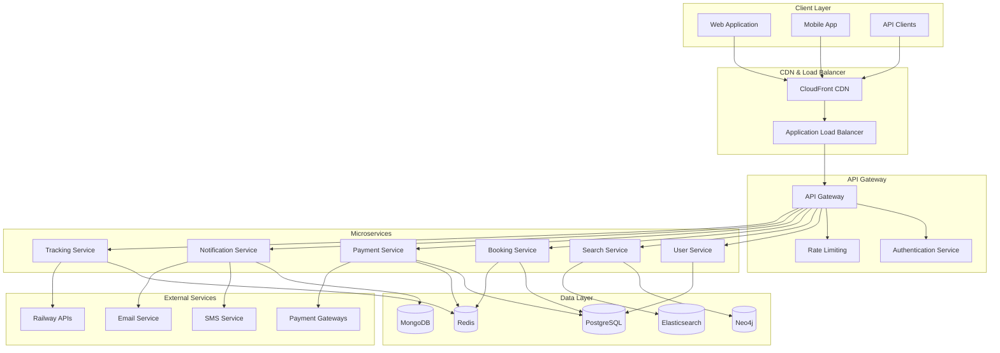
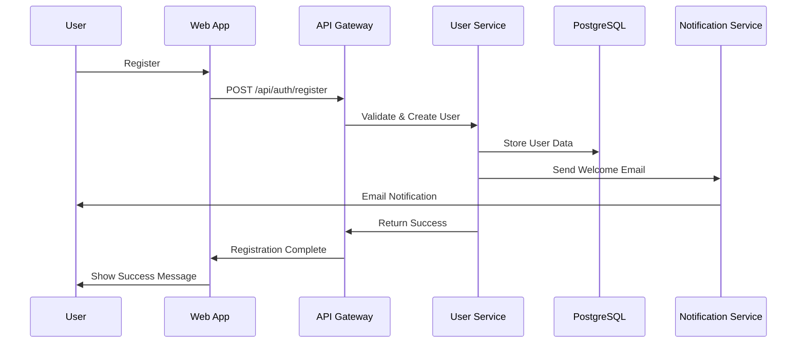
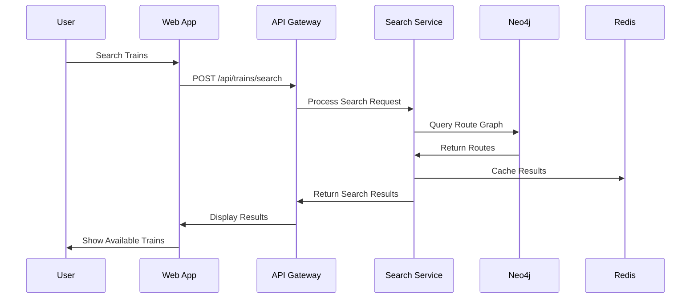
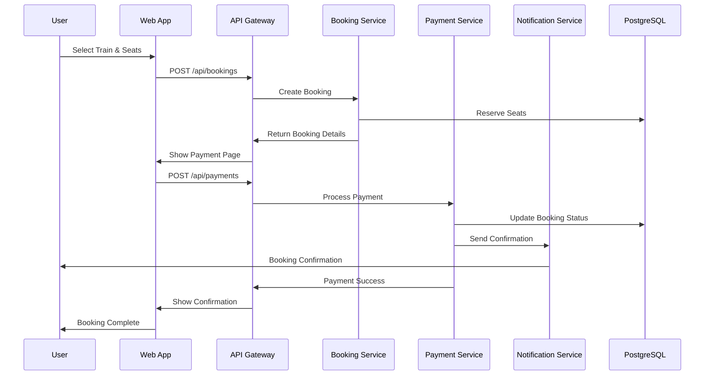

# System Architecture

## Overview

RailConnect India follows a modern microservices architecture designed for scalability, maintainability, and high availability. The system is built using cloud-native principles with AWS infrastructure and containerized services.

## High-Level Architecture

## Component Interactions

### 1. Client Layer
- **Web Application**: Next.js React application with SSR/SSG
- **Mobile App**: React Native application (future)
- **API Clients**: Third-party integrations and partners

### 2. CDN & Load Balancer
- **CloudFront CDN**: Global content delivery and caching
- **Application Load Balancer**: Traffic distribution and SSL termination

### 3. API Gateway
- **Authentication**: JWT token validation and user authentication
- **Rate Limiting**: Request throttling and DDoS protection
- **Request Routing**: Service discovery and load balancing

### 4. Microservices

#### User Service
- **Purpose**: User management, authentication, and profiles
- **Database**: PostgreSQL
- **Key Features**:
  - User registration and login
  - Profile management
  - MFA implementation
  - Session management

#### Search Service
- **Purpose**: Train search and route planning
- **Database**: Neo4j (graph database)
- **Key Features**:
  - Route optimization
  - Real-time availability
  - Price calculation
  - Alternative routes

#### Booking Service
- **Purpose**: Booking management and seat selection
- **Database**: PostgreSQL
- **Key Features**:
  - Seat selection
  - Booking creation
  - Cancellation handling
  - PNR generation

#### Payment Service
- **Purpose**: Payment processing and transaction management
- **Database**: PostgreSQL
- **Key Features**:
  - Multiple payment gateways
  - Transaction processing
  - Refund handling
  - Fraud detection

#### Notification Service
- **Purpose**: Multi-channel notifications
- **Database**: MongoDB
- **Key Features**:
  - Email notifications
  - SMS alerts
  - Push notifications
  - WhatsApp integration

#### Tracking Service
- **Purpose**: Real-time train tracking
- **Database**: Redis (real-time data)
- **Key Features**:
  - Live train positions
  - Delay notifications
  - Platform changes
  - WebSocket connections

## Data Flow Architecture

### 1. User Registration Flow

### 2. Train Search Flow

### 3. Booking Flow

## Service Communication

### 1. Synchronous Communication
- **HTTP/REST**: Service-to-service communication
- **GraphQL**: Flexible data fetching (future)
- **gRPC**: High-performance internal communication (future)

### 2. Asynchronous Communication
- **Message Queues**: AWS SQS for reliable message delivery
- **Event Streaming**: Apache Kafka for real-time events (future)
- **WebSockets**: Real-time client communication

### 3. Service Discovery
- **AWS Cloud Map**: Service registry and discovery
- **Load Balancing**: Application Load Balancer
- **Health Checks**: Automated service health monitoring

## Scalability Architecture

### 1. Horizontal Scaling
- **Auto Scaling Groups**: Automatic instance scaling
- **Load Balancers**: Traffic distribution
- **Database Sharding**: Horizontal database scaling
- **CDN**: Global content distribution

### 2. Vertical Scaling
- **Instance Types**: Optimized EC2 instances
- **Database Optimization**: Query optimization and indexing
- **Caching**: Multi-layer caching strategy
- **Connection Pooling**: Database connection optimization

### 3. Performance Optimization
- **Caching Strategy**: Redis, CDN, and application-level caching
- **Database Optimization**: Indexing, query optimization, and read replicas
- **Code Splitting**: Frontend bundle optimization
- **Image Optimization**: Next.js image optimization

## Security Architecture

### 1. Network Security
- **VPC**: Isolated network environment
- **Security Groups**: Firewall rules
- **NACLs**: Network access control lists
- **Private Subnets**: Internal service communication

### 2. Application Security
- **Authentication**: JWT tokens with refresh mechanism
- **Authorization**: Role-based access control
- **Input Validation**: Comprehensive validation and sanitization
- **Rate Limiting**: DDoS protection and abuse prevention

### 3. Data Security
- **Encryption**: At rest and in transit
- **Secrets Management**: AWS Secrets Manager
- **PII Protection**: Data masking and anonymization
- **Compliance**: GDPR, PCI DSS compliance

## Monitoring & Observability

### 1. Application Monitoring
- **CloudWatch**: Metrics and logging
- **X-Ray**: Distributed tracing
- **Custom Metrics**: Business-specific metrics
- **Alerting**: Automated incident response

### 2. Infrastructure Monitoring
- **CloudWatch**: Infrastructure metrics
- **Auto Scaling**: Performance-based scaling
- **Health Checks**: Service availability monitoring
- **Cost Monitoring**: Resource optimization

### 3. Security Monitoring
- **Security Events**: Comprehensive event logging
- **Intrusion Detection**: Automated threat detection
- **Compliance Monitoring**: Regulatory compliance tracking
- **Incident Response**: Automated security response

## Disaster Recovery

### 1. Backup Strategy
- **Database Backups**: Automated daily backups
- **Application Backups**: Code and configuration backups
- **Cross-Region Replication**: Multi-region data replication
- **Point-in-Time Recovery**: Database recovery capabilities

### 2. High Availability
- **Multi-AZ Deployment**: Availability zone redundancy
- **Load Balancing**: Traffic distribution
- **Auto Scaling**: Automatic recovery
- **Health Checks**: Service monitoring and recovery

### 3. Business Continuity
- **RTO**: Recovery Time Objective < 4 hours
- **RPO**: Recovery Point Objective < 1 hour
- **Failover**: Automated failover procedures
- **Testing**: Regular disaster recovery testing

## Technology Stack

### Frontend
- **Framework**: Next.js 14 with App Router
- **Language**: TypeScript
- **Styling**: Tailwind CSS
- **State Management**: Zustand
- **Data Fetching**: TanStack Query
- **Testing**: Jest, React Testing Library, Playwright

### Backend
- **Runtime**: Node.js 18+
- **Framework**: Express.js, Fastify
- **Language**: TypeScript
- **Authentication**: JWT, OAuth 2.0
- **Testing**: Vitest, Supertest

### Databases
- **Primary**: PostgreSQL
- **Cache**: Redis
- **Graph**: Neo4j
- **Document**: MongoDB
- **Search**: Elasticsearch

### Infrastructure
- **Cloud**: AWS
- **Containers**: Docker, ECS Fargate
- **Orchestration**: Kubernetes (future)
- **CI/CD**: GitHub Actions
- **Monitoring**: CloudWatch, X-Ray

## Deployment Architecture

### 1. Environment Strategy
- **Development**: Local development environment
- **Staging**: Pre-production testing environment
- **Production**: Live production environment
- **Feature Branches**: Isolated feature testing

### 2. Deployment Pipeline
- **Code Commit**: Git-based version control
- **CI/CD**: Automated testing and deployment
- **Blue-Green**: Zero-downtime deployments
- **Rollback**: Automated rollback capabilities

### 3. Infrastructure as Code
- **Terraform**: Infrastructure provisioning
- **CloudFormation**: AWS resource management
- **Docker**: Containerization
- **Kubernetes**: Container orchestration (future)

## Performance Targets

### 1. Response Times
- **API Endpoints**: < 200ms (95th percentile)
- **Database Queries**: < 100ms (95th percentile)
- **Page Load**: < 2 seconds (95th percentile)
- **Search Results**: < 1 second (95th percentile)

### 2. Throughput
- **API Requests**: > 1000 requests/second
- **Database Connections**: > 1000 concurrent connections
- **WebSocket Connections**: > 10,000 concurrent connections
- **File Uploads**: > 100 MB/second

### 3. Availability
- **Uptime**: > 99.9%
- **Error Rate**: < 0.1%
- **MTTR**: < 30 minutes
- **MTBF**: > 720 hours

## Future Enhancements

### 1. Microservices Evolution
- **Service Mesh**: Istio implementation
- **Event Sourcing**: CQRS pattern implementation
- **Domain-Driven Design**: Better service boundaries
- **API Versioning**: Backward compatibility

### 2. Technology Upgrades
- **GraphQL**: Flexible data fetching
- **gRPC**: High-performance communication
- **Kafka**: Event streaming platform
- **Kubernetes**: Container orchestration

### 3. Feature Additions
- **AI/ML**: Recommendation engine
- **Blockchain**: Secure transaction records
- **IoT**: Smart station integration
- **AR/VR**: Enhanced user experience

---

This architecture provides a solid foundation for a scalable, maintainable, and high-performance train routing application. The modular design allows for independent service development and deployment while maintaining system reliability and performance.
